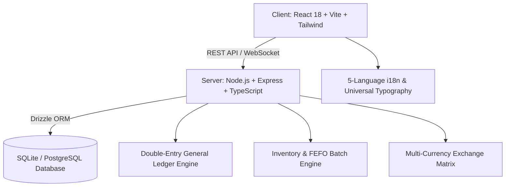

# 39POS & Delivery Hub (Keo) 🚀

[](https://www.typescriptlang.org/)
[](https://reactjs.org/)
[](https://nodejs.org/)
[](https://tailwindcss.com/)
[](LICENSE)

A high-performance, enterprise-grade Point of Sale (POS), Online Delivery Hub, and GAAP Double-Entry Financial Accounting platform designed for omni-channel retail, restaurants, and warehouse management.

---

## 🌟 Core System Features

### 1. 📊 GAAP Accounting & Financial Closing Engine
- **GAAP Period Closing Wizard**: 1-Click period-end financial closing supporting **Monthly**, **Quarterly**, **Yearly**, and **Custom** date ranges.
- **Beginning Balance (ຍອດຍົກມາ) & Carry Forward (ຍອດຍົກໄປສຸດທິ)**: Automatically computes opening balances, period movements (DR/CR), and ending balances across the entire Chart of Accounts.
- **Automated P&L Zeroing**: Generates double-entry period-closing vouchers clearing temporary revenue (`4xxx`) and expense (`5xxx`, `6xxx`) accounts directly into `3020 Retained Earnings` (ຍອດກຳໄລສະສົມ).
- **Extended 6-Column Trial Balance**: Professional balance validation with real-time audit reconciling $\sum \text{Ending DR} = \sum \text{Ending CR}$.
- **Tamper-Evident Period Locking**: Lock closed fiscal periods with authorized 1-click **Unlock & Reopen** capabilities.

### 2. 📦 Refined Purchase Order (PO) Calculator
- **Direct Formula**:
  $$\mathbf{(QTY \times Base\ Cost) + Transportation\ Fee = Total\ Amount}$$
- **Zero Landed Cost Averaging**: Eliminates per-unit shipping fee distortion; retains pure Base Cost in inventory moving average cost (`avgCost`).
- **5-Column Audit Drawer**: Clean and transparent line items (`Product Name`, `Batch & Expiry`, `Qty`, `Base Cost`, `Total Amount`).
- **Accounting Integration**: Auto-splits debits between `1200 Inventory Asset` (products subtotal) and `6040 Delivery/Freight Expense` (transportation surcharge).

### 3. 🛒 Omni-Channel POS & Fast Register
- **3 Dynamic Register Views**: Grid Cards, Mini Tiles, and Compact Fast Rows.
- **FEFO & Expiry Tagging Studio**: Real-time batch & lot tracking with luxury visual expiry badges (Expired, Critical, Warning, Fresh).
- **Multi-Tender Payments**: Cash, Dynamic QR (BCEL One / PromptPay), Bank Transfer, and Accounts Receivable/Payable.

### 4. 🌐 Real-Time Multi-Currency Engine
- Instant live currency switching (**LAK ₭**, **THB ฿**, **USD $**, **CNY ¥**, **JPY ¥**).
- Automated base-to-foreign currency rate conversions with precision rounding.

### 5. 🌏 Universal 5-Locale Internationalization (`i18n`)
- Fully translated and typography-optimized:
  - 🇱🇦 **Lao (`la`)**: `Noto Sans Lao` (Line-height protected)
  - 🇹🇭 **Thai (`th`)**: `Noto Sans Thai Light`
  - 🇺🇸 **English (`en`)**: `Arial Narrow`
  - 🇨🇳 **Simplified Chinese (`zh`)**: `Noto Serif SC`
  - 🇯🇵 **Japanese (`jp`)**: `Noto Serif JP`

---

## 🏗️ Architecture & Tech Stack



- **Frontend**: React 18, Vite, Tailwind CSS, Lucide Icons, Neumorphic Tactile UI system, Zustand state management.
- **Backend**: Node.js, Express, TypeScript, Drizzle ORM, Better-SQLite3 / Postgres.
- **Shared Module**: TypeScript shared business logic (`@pos/shared`) for multi-currency calculations and unified data types.

---

## 🚀 Quick Start

### Prerequisites
- Node.js 18+
- npm 9+

### Installation

```bash
# Clone the repository
git clone https://github.com/se77en9ine-cmd/Keo.git
cd Keo

# Install root & workspace dependencies
npm install --legacy-peer-deps

# Start both Client and Server concurrently
npm run dev
```

- **Client App**: `http://localhost:3000`
- **Server API**: `http://localhost:3001`

---

## 🔒 Security & GAAP Audit Compliance
- Strict double-entry accounting enforcement ($\text{Total Debits} = \text{Total Credits}$).
- Immutability of closed fiscal periods.
- Role-Based Access Control (RBAC) with granular operator permissions.

---

## 📄 License
Released under the [MIT License](LICENSE).
